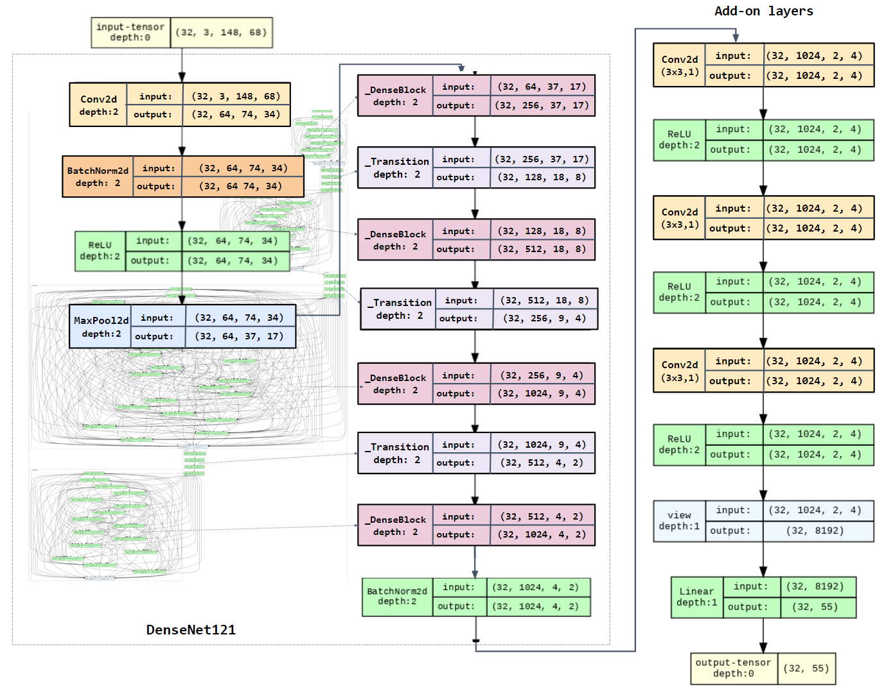

# CountryGuessr: EECS442 Final Project
**By Rodrigo Villegas, Landen Stricker, Yaoxin Li**

In this project we decided to explore the popular game GeoGuessr, and how a neural network could be used to correctly identify the country a street-view picture was taken. The game GeoGuessr boomed in popularity following viral videos from people who had perfected the art of identifying these images, being able to precisely identify the location of an image within seconds. This then sparked our curiosity, prompting us to ask how could a computer compete with these geography fanatics? 

### Results

Inspired by a [Medium blog](https://medium.com/@tef1/geoguessr-guesser-98e01efb5235) by Barrera-Waters et al., we built a DenseNet121-based model combining transfer learning with add-on convolution layers. We trained on street-view image from the GeoGuessr dataset (36,000 pictures from 55 countries).

Our final model achieved 42.8% test accuracy, 13% higher than our benchmark. Here is the **architecture** of our model. In the background you can see expanded DenseBlocks and our 3 conv layers + 1 FC layer is shown to the right.

This is the **Training accuracy** and **confusion matrix** of our final model:

The lowest performing countries were Ukraine and Cambodia which had 0% accuracy, while highest performers were Japan (70.18%) and South Africa (61.44%). Some other top performing countries also include Botswana, Brazil, Australia, Germany, South Africa, Singapore and Finland (56-58%). 

In the confusion matrix, darker color on the diagonal indicate that the country is classified more correctly. Off-diagonal dark spots are where countries are confused with each other. The list of countries is here: [country_index.txt](https://github.com/selina-lii/country_guesser/blob/main/country_index.txt)

### Further thoughts

|  | A bird's eye view of our dataset through UMAP embedding reveals it complexity. Here, each colored dot represent an image from a specific country. There are often no clear distinctions or clusters, making it a perfect challenge for CNN. |
| ------------------------------------------------------------ | ------------------------------------------------------------ |

Have we had more time and computing power, we would like to -

- Train our model with an even bigger dataset, lower learning rate, and a higher amount of epochs. This way we could have perhaps arrived at a more accurate final model with less overfit.

- Down-sample or add a weight term in our loss for countries with more images. This way we can probably solve the 0% accuracy issue for low-sample-size countries.

  

Other problems we will be interested given time could be **image generation**. We were thinking about what if we could create a generation model that given a country name or label, it would generate an image that would look like a street view-image from that country. Or perhaps we could be more specific. Providing the model with coordinates or an address alongside a areal-view of the street, and having the model generate the corresponding street-view of that location.

